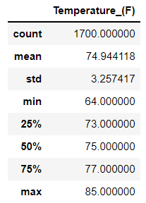

# Surfs Up Challenge

### Background

The purpose of this analysis was to determine if the temperatures in June and December are similar enough to justify opening a surf shop year-round in Hawaii. The data for June and December was pulled for every year within the database.

### Results

The minimum temperatures:

* June: 64.0 F
* December: 56.0 F

The maximum temperatures:

* June: 85.0 F
* December: 83.0 F

The average temperatures:

* June: 74.94 F
* December: 71.04 F

The minimum temperatures across more than five years of data showed less than 08 degrees difference between June and December. The maximum showed a difference of only 02 degrees and the average difference only 3.9 degrees. Both tables can be seen below.

- June Temperature Statistics

- December Temperature Statistics

### Summary

The temperatures saw a minimal change for minimum, maximum, and averages. Notably, the december temps did get cooler at the lowest level, but remained similar for maximum and average temps. This indicates that, while it does get cooler at the lowest moments, the overall and maximum temperatures only see a slight cooling. This could indicate that it would be viable for a year-round business model.

Additional criteria that should be analyzed include:
* Seasonal wave length/height
* Precipitation
* Water temp
* Tourist Activity